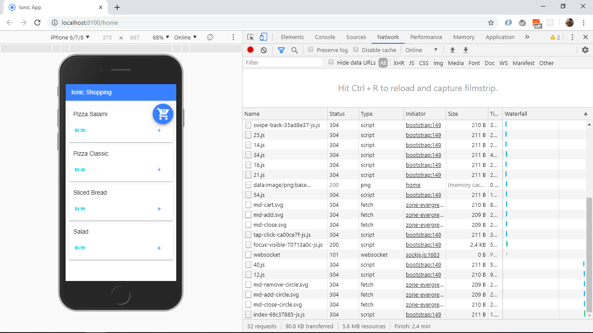
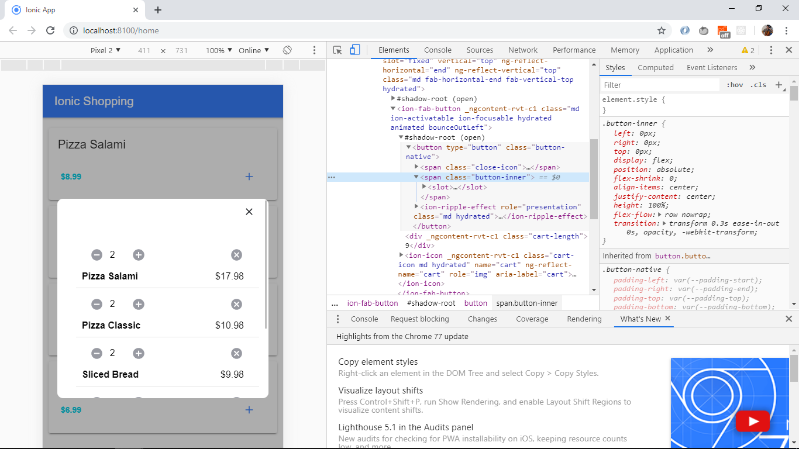

# :zap: Ionic Angular Cart

* Ionic 5 app to show a shopping cart where the user can select items and see them added to a cart. Items can also be removed and the total price and product quantities will be updated. This is another great tutorial from [Simon Grimm of Devdactic, Youtube video 'How to Build a Shopping Cart with Ionic 4'](https://www.youtube.com/watch?v=SYz-tH3XOF8&t=766s).

## :page_facing_up: Table of contents

* [:zap: Ionic Angular Cart](#zap-ionic-angular-cart)
  * [:page_facing_up: Table of contents](#page_facing_up-table-of-contents)
  * [:books: General info](#books-general-info)
  * [:camera: Screenshots](#camera-screenshots)
  * [:signal_strength: Technologies](#signal_strength-technologies)
  * [:floppy_disk: Setup](#floppy_disk-setup)
  * [:computer: Code Examples](#computer-code-examples)
  * [:cool: Features](#cool-features)
  * [:clipboard: Status & To-do list](#clipboard-status--to-do-list)
  * [:clap: Inspiration](#clap-inspiration)
  * [:envelope: Contact](#envelope-contact)

## :books: General info

* modal used to show shopping cart contents: product quantities can be increased or decreased and total price will be adjusted using a simple reduce function.
* animate.css used to provide some fun visual effects when items are added to the cart and when the cart modal is activated and dismissed. There are options to control delays, speed of animation etc.

## :camera: Screenshots




## :signal_strength: Technologies

* [Ionic v5](https://ionicframework.com/)
* [Ionic/angular v5](https://ionicframework.com/)
* [Angular v10](https://angular.io/)
* [rxjs v6](https://angular.io/guide/rx-library) reactive programming.
* [RxJS Behavior subject](http://reactivex.io/rxjs/manual/overview.html#behaviorsubject) to represent the event stream of product cart updates.
* [animate.css v3](https://github.com/daneden/animate.css/) a library of CSS animations.

## :floppy_disk: Setup

* To start the server on _localhost://8100_ type: 'ionic serve'
* To start the server on a mobile using Ionic devapp and connected via wifi, type: 'ionic serve --devapp'
* The Ionic DevApp was installed on an Android device from the Google Play app store.

## :computer: Code Examples

* Cart service: function to add a product to the shopping cart.

```typescript
addProduct(product) {
  let added = false;
  for (const p of this.cart) {
    if (p.id === product.id) {
      p.amount += 1;
      added = true;
      break;
    }
  }
  if (!added) {
    this.cart.push(product);
  }
  this.cartItemCount.next(this.cartItemCount.value + 1);
}
```

## :cool: Features

* Animate.css to animate items.

## :clipboard: Status & To-do list

* Status: Working.
* To-do: add a backend product list. Add to functionality, including a checkout and payment function.

## :clap: Inspiration

* [Simon Grimm of Devdactic, Youtube video 'How to Build a Shopping Cart with Ionic 4'](https://www.youtube.com/watch?v=SYz-tH3XOF8&t=766s).
* [Written version of tutorial from Simon Grimm of Devdactic](https://devdactic.com/shopping-cart-ionic-4/).

## :envelope: Contact

* Repo created by [ABateman](https://www.andrewbateman.org) - you are welcome to [send me a message](https://andrewbateman.org/contact)
